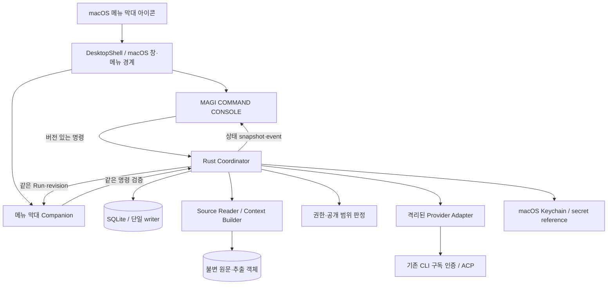

# 실행 구조와 데이터 계약

이 문서는 Oh My MAGI!의 로컬 실행 구조, 데이터 소유권, 공급자 연결과 복구 계약을 정의한다. 제품 의미는 [제품 설계](DESIGN.md), 심의 단계와 표결 규칙은 [심의 프로토콜](DELIBERATION.md), 권한은 [보안](SECURITY.md), 수치 한도와 배포는 [운영](OPERATIONS.md)이 소유한다.

## 1. 구성과 책임

제품은 설치형 macOS 데스크톱 앱이며 웹 서비스·모바일 앱을 배포 대상으로 두지 않는다. Tauri 2, Rust 코어, TypeScript·React 프레젠테이션으로 구성한다. WebView는 설치된 앱 안의 표현 계층이며 브라우저 서비스나 상태 서버가 아니다. MAGI 장면의 기하 구조는 SVG, 본문·조작·접근성은 DOM, 장식 효과는 CSS가 담당한다. 화면 기술의 세부 계약은 [디자인 시스템](DESIGN_SYSTEM.md)을 따른다. OS WebView와 권한을 가진 코어를 분리하는 [Tauri 프로세스 모델](https://v2.tauri.app/concept/process-model/)을 사용한다.

| 경계 | 소유 책임 | 전달하지 않는 권한 |
|---|---|---|
| Console | 사용자 입력, 상태 표시, 근거 탐색, 승인 화면, 연출 | DB 직접 변경, 임의 파일 읽기, 모델 호출, 비밀 조회 |
| Companion | 메뉴 막대의 실행 요약·공개된 코어 상태, 같은 안건의 콘솔 열기 | 파일·제공자·비밀 접근, 별도 Run 저장, 독자적인 모델 호출 |
| DesktopShell | 메뉴 막대 아이콘, 메인 창과 팝오버형 창, macOS 활성화·포커스·화면 좌표·종료 사건 | 실행 상태·표결 결과의 독자적 판정, UI 요청을 통한 권한 확대 |
| Coordinator | Run·명령·권한·quota·checkpoint·표결의 단일 writer | 모델에게 상태 전이·권한 판단 위임 |
| Source Reader | 승인된 경로의 원문 캡처와 추출 | 읽은 문서의 명령 실행, 자동 프로젝트 수정 |
| Context Builder | 범위·출처·누락이 드러나는 ContextManifest 생성 | 숨은 요약, 공급자별 몰래 다른 자료 선택 |
| Provider Adapter | 기능 협상, 인증 경로 연결, 턴 입출력·취소·사용량 관측 | 도메인 DB 쓰기, 최종 결과 판정 |
| Exporter | 사용자가 고른 결의·근거의 명시적 내보내기 | 모델이 지정한 경로에 임의 쓰기 |

Coordinator는 Tauri 코어 안의 모듈이며 독립 네트워크 서버를 요구하지 않는다. 창을 다시 열거나 WebView가 재시작해도 같은 코어에 연결한다. 앱 종료·코어 장애와 실행 중단의 관계는 [수명주기](OPERATIONS.md#lifecycle)를 따른다. 일반 셸·IDE·자동 개발 런타임을 제품 안에 추가하지 않는다.

Rust workspace는 도메인, context, provider, storage, desktop 경계를 가진다. 도메인은 Tauri·특정 LLM SDK·화면 컴포넌트를 import하지 않는다. 공개 DTO는 제품이 소유한 JSON Schema 2020-12에서 Rust·TypeScript 타입을 생성하며, IPC와 공급자 출력은 동일한 스키마 의미로 검증한다. 타입 생성은 참조 무결성·표결 의미 검사를 대신하지 않는다.

### 1.1 DesktopShell과 메뉴 막대

DesktopShell은 Tauri tray 아이콘과 별도의 작은 WebView 창을 소유한다. 아이콘 클릭 위치를 기준으로 이 창을 배치하고 팝오버처럼 열고 닫는다. Tauri의 [System Tray API](https://v2.tauri.app/learn/system-tray/)는 아이콘·메뉴·클릭 사건을 제공하며, 이 계약의 사용자 지정 팝오버는 앱이 관리하는 창이다. Tauri tray가 AppKit `NSPopover`를 자동으로 제공한다고 가정하지 않는다.

메인 창·팝오버의 논리 좌표, 디스플레이 배율, Space, 활성화, 포커스 복귀와 창 닫기 사건은 DesktopShell에서 처리한다. AppKit 연동이 필요한 처리는 이 어댑터 안에 둔다. 심의 도메인과 React 컴포넌트가 macOS 창 객체를 직접 조작하지 않는다. 창의 크기·화면 구성은 [UI/UX §2](UI_UX.md), 열기·닫기·종료의 실행 의미는 [수명주기](OPERATIONS.md#lifecycle)가 소유한다.

### 1.2 두 화면의 공통 상태

Console과 Companion은 같은 Coordinator의 Run ID·revision·event sequence를 읽는다. 표시 대상을 선택하는 규칙은 [화면 계약](UI_UX.md)을 따르며, Companion에서 콘솔을 열면 같은 Run과 선택한 근거로 연결한다. 열린 팝오버는 표시 Run ID를 유지한다. 다른 Run의 시작·완료 사건이 표시 대상이나 확인 중인 명령 대상을 자동 교체하지 않는다. 사용자의 재열기·명시 선택으로 표시 대상을 바꾸면 이전 대상의 확인 화면과 아직 제출하지 않은 명령 초안을 폐기하고 새 snapshot을 읽는다. 접수된 명령은 원래 대상에 연결된 receipt로 추적한다. 두 창은 공통 SVG 기하·시맨틱 토큰·도메인 DTO를 사용하고 각 표현에 필요한 정보 밀도만 달리한다.

팝오버를 열고 닫거나 새로 렌더링하는 동작은 상태 조회와 구독만 수행하며 새 모델 호출은 0회다. 재연결 시 일관된 snapshot을 먼저 받고 이후 이벤트를 적용한다. 최신 revision을 확인하지 못한 화면은 갱신 중임을 표시하며, 캐시한 진행 상태를 근거로 재개·취소 명령을 자동 발행하지 않는다.

Companion에도 창별로 제한된 IPC capability를 적용한다. 파일 선택·권한 동의·제공자 연결 편집은 해당 콘솔 화면으로 연결하며 Companion에 파일·제공자 권한을 부여하지 않는다. Companion이 제공하는 실행 명령도 Coordinator의 동일한 권한·상태·revision·멱등성 검사를 통과한다. 표시 공간이 작다는 이유로 봉인된 표나 미확인 결과를 먼저 공개하지 않는다.

## 2. 정체성과 불변 입력

ID는 앱이 생성한 opaque 값이며 파일 경로·PID·공급자 세션 ID와 구분한다. 모든 불변 객체는 `schema_version`, 객체별 ID, 내용 digest와 별도 생성 envelope를 가진다. 공개 DTO 필드는 snake_case를 사용한다. digest는 정의된 canonical JSON 또는 정확한 원본 bytes에 대한 SHA-256이다. ProposalSnapshot의 정확한 해시 범위는 [심의 프로토콜](DELIBERATION.md#outputs)이 소유한다. 해시는 동일성·손상 탐지이며 내용의 진실성이나 저자의 신원을 증명하지 않는다.

| 객체 | 고정하는 의미 |
|---|---|
| Conversation | 관련 질문·Run·사용자가 선택한 후속 맥락의 컨테이너 |
| QuestionSnapshot | 질문, 사용자가 확인한 의사결정 목적·제약·선택지 |
| ContextManifest | 원문 객체 해시, 포함 범위, 추출기 버전, 손실·누락, 수신 공급자 |
| RoleSetSnapshot | 정확히 3개 코어의 이름·관점·판단 기준·모델 연결·설정 |
| Run | 고정 입력과 심의 사이클, 실행 상태, 부모 Run과 생성 이유 |
| RoleAssessment | 한 코어·단계의 공개 근거·가정·이견·출처·제약 |
| ProposalSnapshot | 표결 대상인 답변 또는 권고 본문·정확한 digest |
| Ballot | 코어, 같은 ProposalSnapshot 참조, 표와 공개 사유 |
| DecisionDossier | 입력·유효 평가·제안·표결·소수 의견·실행 출처를 묶은 기록 |

`preparing`과 `awaiting_confirmation`은 revision이 있는 입력 draft를 편집한다. 변경 시 기존 preflight와 입력·전송 동의를 무효화하고 확인 화면을 갱신한다. snapshot 객체는 생성 즉시 불변이지만, draft가 새 snapshot 참조를 선택하는 것은 허용한다. 사용자의 시작 명령 트랜잭션에서 확인한 draft revision·QuestionSnapshot·ContextManifest·RoleSetSnapshot·정책·호환성 참조와 `input_digest`를 Run에 고정한다. 그 이후 질문·자료·역할·모델·공급자 변경은 새 자식 Run이다. 최초 ProposalSnapshot은 synthesis 검증 시 같은 Run에 한 번 결합하고 이후 제안 수정도 자식 Run을 만든다. 과거 대화는 사용자가 선택한 기록만 고정 입력에 포함한다.

역할의 display name과 모델은 별도 필드다. MELCHIOR·BALTHASAR·CASPER에 같은 모델을 배정할 수 있고 그 상관성을 표시한다. 별도 세션과 가려진 1차 의견은 입력 경로의 독립성을 제공한다. 모델 학습·편향의 통계적 독립성을 보장하지 않는다.

## 3. 원문과 ContextManifest

사용자가 선택한 파일·폴더는 로컬 Source Grant를 만든다. Reader는 선택 범위를 열거하고 제외·미지원·권한 오류를 보여준 뒤 승인된 항목만 캡처한다. 폴더 선택이 숨김 비밀 파일·심볼릭 링크 바깥·다른 볼륨에 대한 무제한 허용이 되지 않는다. 경로 확인과 실제 열기는 [파일 접근 계약](SECURITY.md#source-access)을 따른다.

원본 bytes는 불변 객체로 보관한다. 텍스트·코드의 줄 범위, PDF의 페이지·본문 또는 표 구조, 이미지의 크기·종류는 별도 표현과 locator를 갖는다. OCR·문자 정규화·표 추출·페이지 래스터화는 변환이며 원문과 같은 digest를 사용하지 않는다. 추출 실패·낮은 판독 품질·암호화·잘린 범위는 manifest에 남긴다. 형식을 읽지 못하면 지원하지 않는다고 표시하며 임의 텍스트를 만들어 넣지 않는다.

| 입력 종류 | 허용되는 표현 |
|---|---|
| TXT·Markdown·소스 코드·JSON·CSV | 검증한 문자 인코딩의 전체 텍스트 또는 명시적 줄·필드 범위; 파일 내용 실행 없음 |
| text PDF | 페이지에 대응하는 추출 텍스트; 표·읽기 순서 손실을 표시 |
| PNG·JPEG | 3개 코어와 서기의 vision 지원·입력 예산이 확인된 경우 이미지 자체 전달 |
| scanned PDF | 사용자 선택 페이지의 래스터 표현과 vision 지원을 확인해 전달; 보이지 않는 OCR 대체 없음 |
| Office binary·archive·그 밖의 미지원 형식 | 제외 이유를 표시하고 사용자에게 지원 형식으로 변환한 자료를 선택하게 함 |

이미지를 설명한 모델 생성 텍스트를 원본 이미지와 같은 자료로 표시하지 않는다. vision을 지원하지 않는 binding으로 변경하려면 사용자에게 빠지는 자료를 드러내고 새 ContextManifest를 만든다. OCR을 적용하는 경로는 사용자가 변환과 포함 범위를 확인한 파생 표현으로만 허용한다.

Source 항목은 `source_id`, 표시 이름, 로컬 locator 참조, 캡처 시작·종료 시각, 길이, 원문 digest, MIME, 추출기·버전, 파생 객체, 포함 locator, 제외 이유를 가진다. 공급자에게 로컬 절대 경로를 보내지 않으며 필요한 문서명도 사용자가 검토할 수 있다. 인용은 `source_id + object_digest + locator`에 묶인다. UI는 그 캡처본의 원문·파생 표현·현재 파일의 관계를 보여준다.

캡처 도중 파일 교체·크기 변경·접근 철회를 감지하면 그 항목을 다시 선택·캡처하게 한다. 파일별 획득 bytes를 보존하되 여러 파일을 원자적인 한 시점에 읽었다고 주장하지 않는다. 일관된 프로젝트 상태가 필요한 사용자는 고정된 저장소 revision이나 별도 보존 사본을 입력으로 선택하고 그 기준을 manifest에 기록한다.

공통 context는 세 코어가 모두 수용할 수 있는 입력 한도와 출력 예약량을 기준으로 만든다. 전체 원문이 들어가는지, 일부 범위만 들어가는지, 추출 표현을 쓰는지 실행 전에 표시한다. 넘치는 입력은 명시적 범위 선택 또는 알려진 변환으로 조정하며 자동으로 뒷부분을 잘라내지 않는다. 모델이 실제로 모든 입력에 주의를 기울였다는 보장은 표시하지 않는다.

세 코어는 같은 manifest의 같은 공통 자료를 받고 자기 역할만 다르게 받는다. 추가 자료 조회는 manifest가 이미 승인한 bytes·범위의 읽기만 허용한다. 해당 범위 밖 자료가 필요하면 `paused(reason=needs_input, detail=needs_more_context)`로 기록하고 사용자가 새 manifest를 확인한 자식 Run을 만든다. 한 코어만 새 자료를 받아 기존 표결에 섞을 수 없다.

완료 직전과 기록 재열람 시 원본의 현재 존재·접근 가능·digest를 재확인할 수 있다. 관측 결과는 `unchanged`, `changed`, `missing`, `unreadable`, `unchecked`와 관측 시각을 가진다. freshness는 DecisionDossier의 별도 관측이며 과거 표결을 변경하지 않는다. 변경된 파일의 내용을 기존 근거로 표시하지 않는다.

## 4. 실행 슬롯과 단계 소유권

단계의 의미와 결과 계산은 [심의 프로토콜](DELIBERATION.md)을 따른다. Coordinator가 각 단계를 실행 슬롯으로 분해한다. 한 기본 사이클은 독립 검토 3개, 교차 검토 3개, 종합 1개, 표결 3개다. 종합은 MELCHIOR에 배정된 공급자·모델을 사용하는 새 비투표 서기 세션이며 기존 MELCHIOR 세션과 구분한다.

독립·교차 검토·표결은 슬롯마다 신규 세션을 사용하고 해당 단계에 허용된 고정 입력만 전달한다. 교차 검토는 최초 검토의 공개 결과 전체를 읽는다. 표결에는 자신의 검토·전체 교차 검토·고정 제안과 근거를 제공하며 다른 최종 표는 봉인한다. 기존 세션의 숨은 문맥을 다음 단계의 유일한 근거 저장소로 사용하지 않는다.

### Run 상태 전이

| 상태 | 정상 전이와 필요한 사실 |
|---|---|
| `preparing` | 자료·역할·binding·예산·전송 목록이 준비되면 `awaiting_confirmation` |
| `awaiting_confirmation` | 고정 입력·목적지·예산 확인과 readiness 성공 후 `independent_review` |
| `independent_review` | 유효한 세 독립 평가를 저장하고 공개 장벽을 열어 `cross_review` |
| `cross_review` | 유효한 세 교차 평가를 저장한 뒤 `synthesis` |
| `synthesis` | 참조·구조 검증을 통과한 제안을 한 번 고정한 뒤 `balloting` |
| `balloting` | 같은 제안의 세 유효 표·결과·결의서를 한 트랜잭션으로 저장해 `completed` |
| `paused` | `reason=auth\|quota\|needs_input\|validation`와 `resume_stage`를 보존; 전제조건 재확인과 사용자의 명시적 재개 명령 뒤 그 단계의 미완 슬롯만 재개 |
| `interrupted` | crash 또는 외부 효과 unknown. 실제 실행·dispatch·입력을 조정하고 같은 Run 재개 조건을 충족한 뒤 사용자의 명시적 재개 명령으로 `resume_stage`에 복귀 |
| `cancelling` | 새 dispatch 차단과 앱 소유 실행·입력 채널의 정지를 확인해 `cancelled`; 정지 불명은 `interrupted`에 취소 의도를 유지 |
| `completed`, `cancelled`, `failed` | terminal. 자동 재개·내용 변경 없이 보존하고 필요하면 자식 Run을 생성 |

terminal 이전 단계는 사용자의 취소로 `cancelling`, 회복 가능한 원인으로 `paused`, crash·효과 불명으로 `interrupted`, 확인된 복구 불가 또는 유한 교정 소진으로 `failed`에 갈 수 있다. 그 외 직접 단계 건너뛰기는 허용하지 않는다. paused 확정 전에는 새 dispatch를 닫고 미완 호출의 정지 또는 종료를 관측한다. 불확실한 실행을 남긴 채 paused를 안전한 정지로 표시하지 않는다.

인증 갱신·quota 회복·연결 복구·앱 재실행은 readiness만 갱신하며 모델 호출을 다시 시작하지 않는다. UI는 기존 입력·목적지·남은 예산·미완 슬롯을 보여주고 사용자 재개 명령을 받는다. 재개 명령은 현재 Run revision·동의·binding·기한을 다시 검사한 뒤 미완 슬롯만 발행한다. 입력이나 공급자 변경이 필요하면 재개 버튼으로 우회하지 않고 자식 Run 확인으로 전환한다.

취소·마지막 표 수락은 같은 Run revision에서 직렬화한다. 결과 commit이 먼저면 취소는 이미 완료된 기록을 반환한다. 취소 의도 commit이 먼저면 fence를 올리고 이후 표를 완료에 사용할 수 없다. 앱의 cancelled는 외부 공급자의 추론·과금 취소 확정과 구분하며 공급자 관측은 별도 필드에 남긴다.

자료에서 쟁점을 찾는 동작은 질문을 미리 채운 `answer` Run이다. 별도 예비 모델 호출 없이 같은 확인·심의 절차를 따른다. 제시된 쟁점을 선택하면 부모 기록과 연결한 후속 Run을 만든다.

슬롯은 `slot_id`, Run, 코어 또는 서기, 단계, 고정 입력 digest, `attempt_generation`, provider binding, 호출 예산, 상태를 가진다. 재시도는 같은 슬롯의 새 Attempt이며 이미 검증된 슬롯 출력을 덮어쓰지 않는다. malformed 출력 교정은 슬롯당 한 번만 허용하고 추가 턴 요청을 예산에 소비한다. 교정 실패·의미 불일치·새 자료 요구는 임의 추정으로 메우지 않는다. 수치 한도는 [실행 예산](OPERATIONS.md#limits)이 소유한다.

앱의 턴 요청 수와 공급자 agent 내부의 실제 모델 요청 수는 구분한다. 하나의 ACP prompt가 내부 도구 루프에서 여러 추론을 소비할 수 있다. adapter가 보고한 실제 사용량과 알려진 내부 한도를 기록하고 미제공 값은 unknown으로 유지한다. 앱의 10개 슬롯을 공급자 과금 요청이 정확히 10회라는 약속으로 사용하지 않는다.

1차 검토가 유효해지면 사용자에게 공개 근거를 표시한다. 다른 코어에는 3개 결과가 모두 유효할 때 한 번에 공개한다. UI에 먼저 나타난 의견이 다른 세션의 prompt에 새어 들어가지 않는다. 표결도 같은 제안 digest에 대한 3개 유효 Ballot을 영속화한 뒤 한 트랜잭션에서 공개·결과 계산한다. 도착 순서가 합의 결과를 결정하지 않는다.

출력 parser는 UTF-8·크기·중복 JSON key·닫힌 스키마를 검사한 뒤 Run·코어·슬롯·제안 digest·인용 locator를 대조한다. 모델이 자기 `agent_id`를 바꿔 보내도 다른 코어의 표가 되지 않는다. 출처 링크의 존재를 확인하는 것은 그 주장의 사실 검증과 구분한다.

모델의 숨은 추론 원문을 저장·재생하는 필드를 두지 않는다. 공개 판단 근거·핵심 가정·자료 부족·반론·최종 표만 계약으로 요청한다. 공급자의 thinking 신호는 진행 상태로만 사용하며 원시 추론 스트림을 감사 기록이나 MAGI 패널의 설명으로 노출하지 않는다.

## 5. 공급자와 모델 연결

`ProviderProfile`은 공급자·계정 별칭·사용자가 선택한 기존 CLI 인증 홈 참조와 별도 실행 공간 및 revision을 소유한다. 인증 권위·선택·비밀 경계는 [공급자 인증 계약](SECURITY.md#provider-auth)을 따른다. `ModelBinding`은 provider profile ID와 revision, adapter 버전·digest, 선택 model ID, 지원되는 추론·출력 설정, 검증한 context 한도, 기능 manifest를 고정한다. 루트가 바뀌면 profile revision과 binding 검증을 갱신한다. 실행 snapshot에는 개인 절대 경로를 복제하지 않는다. 모델 이름을 임의로 최신 alias에 매핑하거나 슬롯 실행 중 교체하지 않는다.

### 공급자 실행물과 binding 권위

공급자 실행물의 정체성은 ACP 실행 파일 SHA와 전체 runtime artifact-set digest를 구분한다. artifact-set digest는 고정 manifest의 정규화된 내용을 도메인 구분자로 해시하며 adapter, Codex 실행 파일, 보조 실행 파일, public CA, 소스·패치·lockfile 출처를 함께 묶는다. manifest 순서나 공백은 정체성을 바꾸지 않지만 구성물 또는 출처의 변경은 바꾼다. 모든 파일 hash·서명·아키텍처·출처·CA 검증이 통과한 뒤에만 이 정체성을 발행한다.

카탈로그는 실제 확인한 profile revision, 모델·mode 협상 결과와 전체 artifact-set 정체성을 소유한다. 저장한 모델 선택과 코어별 binding은 이 카탈로그 권위와 선택 revision을 참조한다. admission은 세 코어의 저장된 선택·profile·카탈로그·전체 실행물 정체성을 한 트랜잭션에서 재검증하고 고정 입력과 열 개 슬롯에 동결한다. dispatch는 현재 전역 선택 대신 해당 슬롯의 고정 binding과 generation을 검증한다. 고정된 artifact-set과 실제 검증한 실행물이 다르면 호출을 시작하지 않으며, ACP 실행 파일 SHA 하나가 같다는 이유로 허용하지 않는다. 실행 권위가 없는 기록의 조회는 새로운 실행 권한을 만들지 않는다.

빌드 목적은 검증과 발행을 명시적으로 구분한다. 검사·테스트·lint의 검증 경로는 이미 발행한 공급자 실행물과 추출 helper를 읽기만 하며, resource의 inode·내용·권한을 변경하지 않는다. 기대한 source archive·patch·dependency lock·helper 입력과 전체 manifest 정체성을 대조하고, 모든 구성물의 content hash·엄격한 서명·아키텍처·출처·CA와 파일·상위 디렉터리 권위를 검증한다. 검증한 파일 descriptor를 보유하며 경로 교체·링크·소유권·쓰기 권한의 무효화 조건은 [검증 권위 계약](SECURITY.md#provider-verification)을 따른다. 구성물 누락·입력 변경·정체성 불일치·검증 불가는 검사 실패이며, 자동 발행·서명·권한 수정이나 metadata만으로 검증을 생략하는 근거가 아니다.

실행물 전체의 사용·발행 권위는 생성된 resource와 복원 가능한 실행 저장소 밖의 안정된 제어 영역에 둔다. 앱은 OS·Tauri가 제공하는 실제 resource 경로와 앱 데이터의 제어 경로를 해석해 공급자에 전달하며, 공급자는 그 경로의 권위를 검증하고 보유한다. 설치된 서명 bundle은 읽기 전용으로 유지한다. 개발용 생성 resource 발행은 설치 bundle과 다른 제어 namespace에서 같은 generation·소유자 fence를 적용한다. 실행물 generation과 소유자·작업의 미해결 상태를 영속 기록하며, 소유자 프로세스가 종료되어도 해결된 것으로 바꾸지 않는다. 검증 worker, 보유 cache, 공급자 client와 추출 helper는 실제 작업·하위 프로세스·reader·proxy 정리가 끝날 때까지 읽기 권위를 유지한다. 발행은 새 작업 발급을 차단하고 취소·권위 회수 후 실제 정리 완료 증명을 확인한다. 그 증명과 배타적 권위를 발행 검증·전체 commit·rollback 동안 함께 보유한다. OS lock의 획득, 프로세스 부재, DB의 terminal 상태만으로 외부 효과 종료를 증명하지 않는다. lock 경로·inode가 교체되거나 generation·소유자 증명이 맞지 않으면 발행을 차단한다.

별도의 명시적 발행 빌드는 변경한 입력을 source archive·patch·dependency lock과 함께 고정하고 기존 실행물을 덮어쓰지 않는 새 generation을 만든다. 서명·manifest·구성물 검증이 끝난 뒤 공급자 실행물과 helper resource를 함께 발행한다. 새 generation의 파일과 디렉터리는 쓰기 권한이 없으며, 복사본은 새 inode를 가지되 기존의 불변 실행물·cache·source candidate를 수정하지 않는다. 발행 후 검증 실패·대상 누락·파일 종류 불일치는 전체 발행을 복구하고 성공으로 반환하지 않는다. 발행은 정체성 변경에 따른 카탈로그·binding 재검증을 대신하지 않는다. TLS 신뢰와 네트워크 권한은 [보안 계약](SECURITY.md#provider-tls), backend 선택 근거는 [런타임 신뢰 결정](decisions/0004-provider-runtime-trust.md)을 따른다.

실행물 검증 서비스는 전체 content hash·서명·아키텍처·manifest 출처·CA 검증을 UI event loop 밖의 제한된 blocking worker에서 수행한다. 같은 실행물 generation의 동시 요청은 single-flight 검증을 공유하며, 성공한 서비스는 검증한 파일 descriptor와 불변 정체성을 보유한다. 카탈로그·admission·dispatch는 이 보유 권위를 전달받아 사용하며 같은 요청 안에서 전체 검증을 중복 수행하지 않는다. 검증 중에는 연결 상태를 확인 중으로 표시하고 사용자 취소를 처리한다. 파일 권위의 무효화와 재검증은 [보안 계약](SECURITY.md#provider-verification), 선택 근거는 [검증 권위 결정](decisions/0005-provider-verification-authority.md)을 따른다.

ACP 자체는 프로필 home 경로를 정하거나 attestation하지 않는다. Codex adapter는 프로필별 실행 공간을 구성하고 native broker의 메모리 인증 참조를 공식 런타임에 전달한다. 앱은 adapter의 초기화 응답을 경로 증명으로 취급하지 않으며, 실행 파일·환경 구성·OS sandbox 정책을 검증한다. 프로필 환경을 지정할 수 없거나 sandbox를 적용할 수 없으면 인증·자료 전달을 차단한다. OS 기본 홈이나 다른 프로필로 fallback하지 않는다.

ACP 경로는 `adapter 실행 준비 → 실행 환경·sandbox 검증 → initialize → 인증 확인 → session/new → session/prompt → session/update → 결과 검증`을 따른다. Codex는 프로세스 환경의 `CODEX_HOME`을 통해 독립 설정 루트를 선택하며, 같은 adapter의 서로 다른 `ProviderProfile`은 서로 다른 루트를 사용한다([Codex home 설정 구현](https://github.com/openai/codex/blob/main/codex-rs/config/src/loader/mod.rs)). 프로토콜 버전, 입력 종류, 세션 기능, 인증 방법은 [ACP initialization](https://agentclientprotocol.com/protocol/v1/initialization)에서 협상한다. 이 협상은 프로필 경로의 attestation이 아니다. 광고되지 않은 기능은 미지원이며, [session/load·resume](https://agentclientprotocol.com/protocol/v1/session-setup)은 각각 지원이 확인된 경우에만 사용한다. history load를 살아있는 턴 재연결로 간주하지 않는다.

| 연결 경로 | 소유 계약 |
|---|---|
| 검증된 로컬 agent + ACP | 사용자 소유 공식 인증, adapter 프로세스 관리, 제한된 세션·도구·문맥 |
| 공급자의 공식 로컬 구조화 인터페이스 | ACP와 동일한 제품 요구사항을 adapter가 구현하고 적합성으로 증명 |

ACP 응답 reader는 RPC 결과·취소·종료와 텍스트 fragment를 함께 처리하므로 느린 저장·화면 소비자를 기다리지 않는다. 텍스트 전달은 별도의 소비자가 유한한 byte buffer에서 순서를 보존해 인접 fragment를 합친다. 전달 queue가 가득 차면 보유한 텍스트를 잃지 않고 소비자 wake를 합치며, queue 압력을 출력 한도 초과로 판정하지 않는다. byte·누적 이벤트 상한과 메모리 소유권은 [실행 한도](OPERATIONS.md#limits)를 따른다.

미리보기 fragment와 최종 응답은 같은 누적 텍스트 권위를 사용한다. 정상 완료는 승인한 텍스트 전체가 순서대로 전달·저장되고 최종 본문과 일치한 뒤 확정한다. 취소·한도 초과는 대기 소비자를 깨우고 terminal 상태와 구분해 관측하며, 잘린 본문을 정상 결과로 반환하지 않는다. RPC reader에서 소비자 완료를 기다리거나 소비자와 같은 lock을 잡은 채 blocking 저장을 수행하지 않는다.

ACP는 인증 권리·무료 사용량·무제한 토큰을 부여하지 않는다. 무료 티어도 공급자가 설정한 한도를 따른다. Oh My MAGI!가 토큰을 수집해 다른 사용자에게 배분하거나 구독을 중개하지 않는다. 배포 형태별 공급자 조건과 인증 소유권은 [보안 계약](SECURITY.md#provider-auth)을 따른다.

모든 adapter는 다음 admission 자료를 갖는다.

- 정확한 agent·adapter·OS·모델 버전 조합과 지원 프로토콜 범위.
- 새 세션 생성, 독립 문맥, 공개 출력 수신, 취소·종료 관측, 호출 상한 집행.
- 원래 파일 쓰기·임의 셸·무제한 파일 읽기 차단과 승인된 context만 노출하는 방법.
- 전역 instruction·memory·plugin·hook·MCP 자동 로딩의 비활성화 또는 격리 증거.
- model 설정·input 한도·usage 관측의 지원 여부와 unknown인 값.
- 공급자 조건 검토 근거와 기존 인증 연결·취소·재연결·격리 적합성 기록.

필수 기능을 검증하지 못하면 해당 binding의 시작을 차단한다. ACP 연결 성공이나 read-only라는 prompt만으로 합격시키지 않는다. native 도구·자격증명·OS 경계의 실제 한계는 [보안](SECURITY.md#agent-isolation)에 표시한다. 사용자는 호환되는 다른 연결을 선택할 수 있으며 앱은 자동 유료 전환·다른 계정 우회를 하지 않는다.

## 6. 명령·저장·멱등성

모든 UI 변경 명령은 `command_id`, `idempotency_key`, 대상 ID, `expected_revision`, 정규화 payload digest를 갖는다. 메인 창과 Companion은 이 명령 경로를 공유한다. Coordinator는 현재 권한·CAS·상태 전제조건을 확인하고 의도·receipt·이벤트·필요한 dispatch outbox를 한 SQLite 트랜잭션으로 저장한다. commit 뒤에만 접수 성공을 반환한다. 외부 모델의 완료는 별도의 관측이다.

같은 store·명령 종류·대상·멱등 키의 같은 payload는 최초 receipt를 반환한다. 같은 키의 다른 payload는 충돌이다. CAS 불일치는 최신 참조와 충돌을 반환하며 UI가 자동으로 revision만 바꿔 재실행하지 않는다. 명령과 receipt는 Run 삭제 전까지 유지하며 삭제된 Run은 tombstone으로 옛 명령의 재실행을 막는다.

### 실행 접수 요청의 권위와 보존

Start의 영속 명령 정체성과 접수 권한 token은 별개다. Native는 Start를 기다리기 전에 명령 종류·대상·`command_id`·`idempotency_key`·직접 정규화한 의도 digest에 결합한 token을 등록한다. Token은 현재 프로세스 세대와 절대 만료 시각을 가진다. 미등록·만료·다른 프로세스 세대의 token은 새 실행 권한을 만들지 않는다. 저장된 같은 명령의 receipt 조회와 멱등 재생은 token을 재발급하거나 외부 효과를 다시 시작하지 않는다.

접수 전 취소는 별도의 형식이 고정된 receipt와 변경 불가능한 명령 fence를 한 트랜잭션에 저장한 뒤 성공을 반환한다. Fence는 원래 Start 명령과 같은 멱등 의도를 사용하는 명령 별칭에 적용되며 재시작 뒤에도 유지된다. 등록 전 취소도 정확한 Start 의도와 멱등 binding을 고정한다. 명령 ID만 알고 별칭의 멱등 의도를 확인하지 못한 경우에는 취소 성공을 반환하지 않는다. 다른 payload와의 충돌은 성공이나 새로운 등록으로 바꾸지 않는다. 접수와 취소가 경합하면 commit 이전의 fence는 접수를 막고, commit이 먼저 완료되면 정확한 Run에 영속 취소를 접수한다.

메모리에는 살아 있는 접수 권위와 worker 참조만 제한된 용량으로 보유한다. 만료 또는 terminal 상태와 worker 정리가 모두 확인되면 무거운 상태를 회수한다. 취소한 명령의 영속 fence는 이 회수와 독립적이다. 회수한 token을 재등록하여 같은 명령의 취소를 지우지 않는다. 접수 deadline은 commit 경계에서 평가하며 접수 후 전체 심의 수명으로 전이하지 않는다.

영속 fence는 실행 계보에 결합한다. 정상 재시작은 계보와 취소 fence를 유지하고 프로세스 세대만 바꾼다. 백업 복원은 기록의 store 정체성을 보존하되 새 실행 계보와 store generation을 발급한다. 복원한 접수 binding과 receipt는 조회 권위이며 새 token이나 효과의 허가가 아니다. 새 실행에는 현재 계보의 새 명령 ID·멱등 키와 재검증한 입력이 필요하다. 복원한 과거 명령을 새 계보에 등록하여 실행하지 않는다. 보존·백업 경계는 [운영 계약](OPERATIONS.md#6-보존삭제백업), 선택 근거는 [영속 취소 결정](decisions/0006-durable-admission-cancellation.md)을 따른다.

Conversation에는 동시에 하나의 활성 Run만 바인딩한다. 다른 Conversation의 Run은 같은 전역 공급자 큐를 공정하게 공유하며 호출 한도·계정 quota를 함께 소비한다. 한 대화의 pause가 다른 대화의 조회·정상 실행을 막지 않는다. 같은 대화에서 수정·자식 Run 시작 시 기존 활성 Run의 정지·세대 폐기를 먼저 확정한다.

SQLite는 data root마다 OS lock으로 단일 writer를 보장한다. 상태·명령·outbox·구조화 결과·이벤트가 정본이고 UI 캐시는 투영이다. source와 큰 결과는 temp 파일의 길이·해시 검증, flush, 불변 이름으로 설치와 디렉터리 durability 확인 뒤 DB에서 참조한다. DB에 없는 객체는 GC 후보이고 DB가 가리키는 객체의 누락은 손상이다. flush와 환경의 제약은 [SQLite 원자 commit 설명](https://www.sqlite.org/atomiccommit.html)에 따라 실제 장애 수용기준으로 검증한다.

dispatch outbox는 외부 요청 전 `prepared`와 입력 digest를 기록한다. 실제 전송 시점부터 확정 응답까지의 장애는 요청이 소비됐을 수 있다. provider request/turn ID로 조회할 수 있으면 조정하고, 없으면 `interrupted`에 unknown 사유를 남긴다. 응답을 못 받았다는 이유만으로 같은 모델 호출을 자동 반복하지 않는다. 외부 추론·과금에 exactly-once를 보장하지 않는다.

## 7. 이벤트·checkpoint·fencing

영속 이벤트는 store ID·generation·단조 sequence·Run revision·이벤트 종류·payload schema를 가진다. 시각은 표시·진단용이고 순서 정본은 sequence다. Console과 Companion은 DB의 일관 snapshot과 해당 high-water 이후 이벤트를 각 구독에 적용한다. 중복을 제거하고 누락·cursor 만료·store 복원 시 다시 snapshot을 읽는다. 한 창의 숨김·구독 해제가 다른 창의 구독이나 Run 수명을 종료하지 않는다. 스트리밍 미리보기는 확정 평가·표·결의가 아니다.

checkpoint는 고정 입력 참조, 현재 단계, 검증 완료 슬롯, pending dispatch·provider request ID, Attempt generation, 예산 소비, 공개 경계, 최신 event sequence를 포함한다. checkpoint는 단계 전이·출력 수락과 같은 트랜잭션에서 갱신한다. 요약문이나 화면의 마지막 줄로 재개 지점을 결정하지 않는다.

모든 공급자 이벤트는 Run·slot·Attempt generation·session binding에 묶인다. pause·취소·교체·복구로 세대가 바뀌면 오래된 결과는 진단용으로 분리하고 현재 표결에 적용하지 않는다. fence는 앱이 오래된 결과를 수락하지 않게 할 뿐 이미 나간 클라우드 요청·native 프로세스를 정지시키지 않는다. 그 정지는 별도로 확인한다.

재개는 고정 입력·정책·공급자·세션 경계를 보존하고 불확실한 dispatch를 해소한 경우에만 같은 Run을 사용한다. 문맥을 보존할 수 없거나 변경이 필요하면 기존 기록을 보존하고 자식 Run을 만든다. `completed`, `cancelled`, `failed`의 terminal 기록을 수정해 재활성화하지 않는다. 후속 근거·현재 파일 freshness·사용자 메모는 별도 연관 기록이다.

## 8. 외부 공유 재생

공유 재생의 export·import는 동일한 버전 있는 closed JSON 형식 `magi-replay`를 사용한다. 묶음은 `format`, `schema_version`, 표시용 제목, 공개 질문, 세 코어의 표시 정보, 공개 평가, 공유 제안, 공개 표, 재생 이벤트를 가진다. 원문 객체·로컬 locator·인증·grant·실행 가능한 명령·외부 asset URL·archive 첨부는 포함하지 않는다. 원문을 포함하는 사용자용 기록 내보내기는 이 공유 형식과 다른 명령이다.

공유 제안은 `kind`, `body`, `conditions`, `alternatives`, `open_objections`와 `proposal_digest`를 가진다. 공개 출력과 인용 표시는 저장 객체를 가리키지 않는 공유본 전용 ID·plain text로 변환한다. export에서 비공개 내용을 제거하면 공유 제안의 내용을 기준으로 digest를 새로 계산하며 원래 ProposalSnapshot digest와 혼동하지 않는다. 해시 입력은 `proposal_digest`를 제외한 공유 제안 필드의 JCS UTF-8 bytes다. 묶음의 공개 표는 원본 결과의 표시용 사본이며 정제한 문안에 다시 투표했다는 뜻이 아니다. 필수 `redactions`는 달라진 필드·범위를 원래 비공개 값을 포함하지 않고 기록하며, `redacted` 표시는 내보낸 사실대로 고정한다.

import는 별도의 `ExternalReplay`를 생성한다. 이 객체는 `external_replay_id`, 파일 digest, 지원 형식 버전, import 시각, 검증한 공유 데이터만 소유한다. 원래 로컬 Run·ContextManifest·DecisionDossier의 정체성이나 증거 권위를 획득하지 않으며 실행 상태 머신으로 들어갈 수 없다. 기록 ID가 일치해도 기존 Run에 병합하지 않는다.

재생 이벤트는 단조 `sequence`, 상대 `offset_ms`, 등록된 `type`, 공유 객체 ID만 가진다. `type`은 `phase_entered`, `assessment_available`, `proposal_frozen`, `ballots_revealed`, `run_ended`로 한정하고 각 payload도 버전별 closed schema를 가진다. 참조가 없거나 순서·단계·공개 경계가 맞지 않으면 import를 거부한다. 원시 provider stream·임의 명령을 event payload로 재생하지 않는다.

공유 제안 digest와 표·이벤트의 참조를 다시 계산·검사한다. 이 검사는 묶음 내부의 내용 일관성만 확인하며 원문 존재·실제 공급자 호출·모델 신원·작성자·실행 시각의 진위를 보증하지 않는다. 화면은 항상 `EXTERNAL REPLAY`와 수정 가능한 공유본이라는 표시를 유지하고, 실행이나 사실 검증을 했다는 배지를 추가하지 않는다. import·재생은 모델 호출·원문 읽기·권한 생성·외부 통신을 수행하지 않는다.

## 9. 제품 확장 경계

심의 엔진은 대화·근거·역할·제안·표결 계약을 소유하고 MAGI 이름·도형·음원·연출은 presentation package가 소유한다. 역할 preset은 버전 있는 데이터이며 실행 코드·셸·외부 MCP URL을 포함하지 않는다. import한 preset도 스키마와 권한 검사를 거친다.

제품 구조의 선택은 [기본 설계 결정](decisions/0001-command-console.md), macOS 호스트와 메뉴 막대의 선택은 [데스크톱 설계 결정](decisions/0003-desktop-menu-bar.md)에 둔다. 인증 대기와 실행 시간 권위의 분리는 [영속 인증 시간 결정](decisions/0008-durable-authentication-clock.md)에 둔다. 실행물의 빌드 검증 입력 수명은 [출처 입력 수명 결정](decisions/0009-runtime-build-provenance-lifetime.md)에 둔다.
