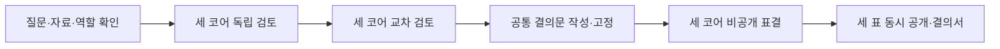

# 심의 프로토콜

이 문서는 질문·역할·검토·결의문·투표·결의서의 의미를 소유한다. 실행 상태와 영속 명령은 [아키텍처](ARCHITECTURE.md), 자료와 도구 권한은 [보안](SECURITY.md), 호출 한도는 [운영](OPERATIONS.md)이 소유한다.

## 1. 용어와 데이터 권위

| 객체 | 의미·필수 내용 | 변경 규칙 |
|---|---|---|
| `Conversation` | 질문과 심의의 사용자 대화 묶음 | 제목·보관 설정을 편집해도 과거 심의 내용은 유지 |
| `QuestionSnapshot` | 원문 질문, `answer` 또는 `recommendation`, 사용자가 제시한 조건·평가 기준, 선택한 이전 기록 참조 | 확인 후 불변; 수정은 자식 Run |
| `ContextManifest` | 승인 자료의 snapshot·포함 범위·추출 방식·전송 대상 | [아키텍처](ARCHITECTURE.md)가 형식과 캡처를 소유 |
| `RoleSetSnapshot` | 정확히 세 코어의 역할과 공급자·모델 경로의 고정된 참조 | 확인 후 불변; 역할 교체는 자식 Run |
| `Run` | 하나의 고정된 질문·자료·역할 조합에 대한 심의 | 상태·재시도·중단은 아키텍처 계약 |
| `RoleAssessment` | 코어별 공개 주장·근거·가정·정보 결손·교차 검토 | 단계별 검증된 결과를 불변 저장 |
| `ProposalSnapshot` | 표결 대상인 답변 또는 권고 문안과 그 조건 | synthesis에서 생성하고 한 번 고정; 이후 변경은 자식 Run |
| `Ballot` | 한 코어가 고정된 ProposalSnapshot에 내린 지지·반대·기권과 이유 | 역할별 유효 표 하나; 확정 후 수정 없음 |
| `DecisionDossier` | 문안·표·근거·이견·한계·입력 식별자를 모은 결의서 | 완료 시 고정; 현재 원본 상태는 별도 표시 |

각 snapshot과 단계 산출물은 `schema_version`, 고유 ID, 생성 시각, 소속 Run, 내용 digest를 가진다. 사용자에게 보여주는 ID는 줄일 수 있지만 저장·참조·검증에는 전체 ID를 사용한다. 자료와 모델의 현재 설정은 이미 저장된 snapshot의 의미를 바꾸지 않는다.

## 2. 세 코어의 역할

| 고정 코어 ID | 기본 관점 | 반드시 묻는 것 |
|---|---|---|
| `MELCHIOR-1` | 근거와 실현 가능성 | 확인된 사실인가, 구현·운영 조건이 충족되는가, 무엇이 반증이 되는가 |
| `BALTHASAR-2` | 지속 가능성과 돌봄 | 장기 비용과 피해는 무엇인가, 유지 가능한가, 누가 부담을 지는가 |
| `CASPER-3` | 자율성과 대안 | 사용자의 의도와 맞는가, 숨은 선택지는 없는가, 포기하는 가치는 무엇인가 |

원작의 세 인격에서 영감을 얻되 성별·가족 역할을 능력이나 성격의 고정 관념으로 구현하지 않는다. 세 코어의 기본 식별과 배치는 유지하면서 사용자가 목적에 맞는 관점을 덧붙인다. 어느 코어에도 영구 거부권이나 추가 표를 부여하지 않는다.

역할 프로필은 `profile_id`, `revision`, 표시명, 검토 목적, 중시 기준 목록, 반증 질문, 응답 언어를 가진다. `RoleSetSnapshot`은 세 프로필과 각 코어의 provider binding revision을 담는다. 저장 전에 정확히 세 고유 코어인지, 필수 관점이 비어 있지 않은지, 지원 길이와 구조를 만족하는지 검증한다.

역할 편집은 관점과 평가 기준만 바꾼다. 도구·파일·네트워크·과금·정족수·시스템 프롬프트의 권한 경계는 바꾸지 못한다. 역할 import는 데이터 형식만 받으며 실행 코드, 셸, 원격 자동 설치를 허용하지 않는다. 같은 내용의 역할 세 개는 구문상 저장할 수 있으나 관점 중복을 표시한다.

기본 프로필 이외에 기획 검토, 서비스 구조 검토, 개인 계획 관점을 저장할 수 있다. 각 프리셋도 동일한 세 역할 계약을 만족하며, 사용자가 프리셋을 고른 사실만으로 근거나 권한이 추가되지 않는다.

모델은 코어마다 다르게 연결하거나 동일한 모델을 사용할 수 있다. UI는 동일 모델·동일 제공자 여부를 표시한다. 별도 세션과 관점은 입력 오염을 줄이지만 학습 데이터·모델 편향의 상관관계를 제거하지 않는다. 역할 수를 독립적인 지능의 수나 정확도 배수로 설명하지 않는다.

## 3. 심의 입력의 고정

심의 입력은 질문 원문, 사용자가 적은 제약과 기준, 허용 자료, 선택한 이전 결의서, 세 역할, 모델 경로, 프로토콜 버전으로 구성한다. 이 조합을 확인한 뒤 `input_digest`를 고정한다.

질문은 다음 두 형식 중 하나를 갖는다.

| 형식 | 목적 | 표결이 평가하는 대상 |
|---|---|---|
| `answer` | 설명·비교·요약·쟁점 발굴 | 해당 답변 문안이 질문에 적절히 응답하고 근거·한계를 표현하는지 |
| `recommendation` | 명시된 선택·행동에 대한 권고 | 문안에 적힌 대안과 조건을 사용자의 기준에서 지지하는지 |

입력 확인 화면에서 형식과 해석을 보여준다. 기준을 모델이 임의로 추가해 사용자 선호로 기록하지 않는다. 모호한 질문도 검토할 수 있지만 의미가 달라질 필수 정보는 `needs_input`으로 요청한다. 사용자 답으로 질문이 바뀌면 부모와 연결된 새 심의를 만든다.

독립 검토에는 동일한 허용 입력을 전달한다. 모델별 입력 한도가 다르면 가장 작은 지원 범위로 공통 자료를 선정하고 사용자가 승인한다. 한 코어에만 조용히 자료를 잘라 보내지 않는다. 역할별 제공자에게 보내는 실제 데이터와 동의는 [보안 계약](SECURITY.md)을 따른다.

이전 대화는 사용자가 선택한 기록만 포함한다. 결과의 요약을 넣으면 원문 기록의 ID·digest와 요약 여부를 함께 표시한다. 모델의 숨은 장기 기억이나 다른 대화가 심의 입력이 되지 않도록 adapter의 실행 자격을 검증한다.

## 4. 한 번의 심의 절차

### 4.1 독립 검토

세 코어를 분리된 신규 세션으로 호출한다. 다른 코어의 중간 출력·완료 결과·표는 입력에 포함하지 않는다. 공급자 동시 실행 한도로 순서대로 처리해도 동일한 차단 규칙을 유지하며 화면에는 대기 중인 코어를 대기로 표시한다.

각 코어는 역할 관점에서 답·대안, 근거, 가정, 주요 위험, 반증 조건과 정보 결손을 제출한다. 형식 검증이 끝난 공개 판단 근거는 사용자에게 바로 보여줄 수 있다. 세 결과가 모두 유효해지기 전에는 다른 코어에게 공개하지 않는다.

### 4.2 교차 검토

세 독립 검토가 모두 준비되면 각 코어가 전체 공개 검토를 읽는다. 각 코어는 다른 주장에 대해 동의, 이의 또는 추가 근거 요구를 명시하고 `target_claim_id`와 이유를 연결한다. 자기 입장을 바꾸면 변경된 주장과 영향을 준 근거를 명시한다.

좋은 교차 검토는 반대 의견의 개수로 판단하지 않는다. 근거가 다른 주장, 값의 충돌, 범위 누락, 조건의 불일치를 구체적으로 드러내는지가 기준이다. 단순히 다른 코어가 동의했다는 사실을 새 근거로 추가하지 않는다.

### 4.3 결의문 작성

서기 호출 하나가 세 최초 검토와 세 교차 검토에서 공통 결의문을 작성한다. 이 호출은 MELCHIOR-1에 연결된 제공자·모델을 사용하지만 새로운 서기 세션과 별도 중립 프롬프트로 실행한다. 화면에는 `결의문 작성`으로 표시하며 네 번째 코어 또는 추가 표로 세지 않는다.

서기는 질문의 형식·범위·사용자 기준을 유지하고, 불일치를 해소했다고 주장할 때 근거를 연결한다. 해소되지 않은 이견은 `open_objections`에 원래 주장 ID와 함께 남긴다. 모든 의견을 평균내거나 다수의 진술을 검증된 사실로 바꾸지 않는다.

결의문 후보는 사용자에게 초안으로 보인다. 분석·권고만 제공하므로 표결을 위해 별도의 실행 승인을 요구하지 않는다. 원본 수정이나 외부 행동의 허락을 의미하지도 않는다. 사용자가 후보 문안을 수정하면 현재 심의를 취소하거나 보존한 후 새 심의로 제출한다.

후보가 구조·참조 검사를 통과하면 `ProposalSnapshot`을 한 번 고정한다. 세 표가 평가하는 본문·조건·대안·근거와 미해결 이견은 이 snapshot에 들어 있다. 고정 후 본문을 고치는 것은 같은 표결의 일부가 아니다.

### 4.4 표결과 종료

각 코어의 신규 표결 세션에는 고정된 결의문, 승인된 근거, 자신의 검토와 전체 교차 검토를 전달한다. 다른 코어의 최종 표는 제공하지 않는다. 유효 세 표가 모이기 전까지 사용자 화면에는 제출 여부만 표시한다.

세 표를 모두 검증한 뒤 하나의 저장 트랜잭션에서 집계와 결과 이벤트를 확정한다. UI는 이 이벤트를 받아 세 표를 함께 드러낸다. 결의문은 표결 후 LLM이 다시 요약해 바꾸지 않는다. 사용자가 읽는 최종 답변은 투표한 문안과 동일하며 표·이견·한계는 앱이 별도 필드로 붙인다.

한 Run은 위 절차 한 번으로 종료한다. 앱이 보내는 턴 요청은 독립 3회, 교차 3회, 서기 1회, 표결 3회다. ACP 에이전트는 한 턴 안에서 추가 추론을 수행할 수 있으므로 이 수를 실제 추론·HTTP·과금 호출 횟수로 표시하지 않는다. 형식 수선·전송 재시도는 [운영 예산](OPERATIONS.md) 안에서 별도 계수한다. 반대나 미결이라는 이유로 동의가 나올 때까지 반복하지 않는다. 재심의는 사용자의 후속 요청으로 새 Run을 만든다.

## 5. 구조화 산출물과 검증

### 5.1 RoleAssessment

필수 envelope는 `schema_version`, `run_id`, `attempt_id`, `core_id`, `stage`, `input_digest`다. `stage`는 `independent_review` 또는 `cross_review`다. body에는 `position_summary`, `claims`, `assumptions`, `information_gaps`, `counterarguments`를 담는다. 교차 검토에는 `claim_responses`와 `position_changes`를 추가한다.

| claim 필드 | 계약 |
|---|---|
| `claim_id` | 해당 Run 안에서 고유하며 후속 이의가 참조할 수 있는 식별자 |
| `kind` | `source_fact`, `model_knowledge`, `inference`, `preference`, `assumption` 중 하나 |
| `text` | 사용자에게 공개할 짧은 주장 |
| `evidence_refs` | 허용 manifest 안의 snapshot ID·원문 범위·필요한 인용 |
| `limitations` | 자료·방법·범위의 한계 |

`source_fact`에는 최소 하나의 유효 원문 참조가 필요하다. `model_knowledge`는 제공 자료로 확인되지 않은 모델 지식이라는 표시를 유지한다. 사용자 발언은 입력 참조로 연결하며 그 발언만으로 외부 사실이 검증됐다고 보지 않는다.

인용 위치·내용 hash·허용 범위는 결정적으로 검증한다. 원문 참조가 존재한다는 사실과 그 자료가 주장을 실제로 뒷받침한다는 판단은 다르다. 후자는 교차 검토와 사용자의 원문 조회 대상으로 남긴다. 기계 검증 통과를 사실 검증 완료로 표시하지 않는다.

`information_gaps`의 각 항목은 부족한 내용, 영향, `essential` 여부를 담는다. 필수 질문 의미가 결손되면 `paused(reason=needs_input)`로 이동한다. 승인 범위 밖 자료가 필요하면 권한을 확장하지 않고 사용자에게 필요한 범위를 제시한다. 새 자료는 새 manifest와 자식 Run으로 들어간다.

### 5.2 ProposalSnapshot

| 필드 | 계약 |
|---|---|
| `schema_version`, `proposal_id`, `run_id` | 형식·소속 식별 |
| `question_digest`, `context_digest`, `roles_digest` | 입력 snapshot과의 정확한 연결 |
| `kind` | QuestionSnapshot과 같은 `answer` 또는 `recommendation` |
| `body` | 사용자가 최종 답변으로 읽고 코어가 표결하는 본문 |
| `claims` | 주장 종류와 출처를 유지하는 구조화된 근거 |
| `conditions` | 권고가 성립하는 명시적 조건 |
| `alternatives` | 검토한 대안과 채택·보류 이유 |
| `open_objections` | 해소되지 않은 주장 ID, 반대 이유, 필요한 추가 확인 |
| `digest` | 아래 고정 규칙으로 계산한 내용 hash |

`digest`를 제외한 위 필드를 [RFC 8785 JCS](REFERENCES.md#canonical-json)로 직렬화한 UTF-8 바이트에 SHA-256을 적용한다. 생성 시각 등 저장 envelope는 내용 밖에 둔다. 표시용 줄바꿈·레이아웃은 자유지만 본문·조건의 문자를 자동 재작성하지 않는다. 화면에 인쇄한 짧은 digest는 검증값을 대체하지 않는다.

### 5.3 Ballot

필수 필드는 `schema_version`, `run_id`, `attempt_id`, `core_id`, `input_digest`, `proposal_id`, `proposal_digest`, `vote`, `rationale`, `objection_refs`다. `vote`는 [표결 enum](#ballots)만 받는다. `rationale`는 판단의 요약이며, 비공개 사고 과정을 요구하거나 저장하는 필드가 아니다.

구문·타입·필수 필드·알 수 없는 필드·상한을 검사하고, 모든 참조가 해당 Run과 승인 범위에 속하는지 검증한다. 임의 enum이나 참조가 없는 표를 가까운 값으로 보정하지 않는다. 공개 텍스트에 들어간 찬반 단어를 파싱해 표를 추측하지 않는다.

형식 오류는 같은 입력과 슬롯에서 한 번 수선할 수 있다. 이 수선은 누락된 값의 형식을 요구하며 주장이나 표의 방향을 지시하지 않는다. 재실패는 유효 출력의 부재로 처리하고 다음 단계의 장벽을 열지 않는다. 원본 오류 결과는 비밀을 제거한 진단 정보로 보관하며 유효 표와 분리한다.

## 6. 표결·결과 함수

| 표 | 의미 |
|---|---|
| `support` | 지금 고정된 문안과 명시된 조건을 지지한다 |
| `oppose` | 문안·근거·선택·조건 중 구체적인 이유로 지지하지 않는다 |
| `abstain` | 표는 정상 제출했지만 자신의 판단에 필요한 근거나 전문 범위가 부족하다 |

결의문에 없는 조건을 추가해야만 지지할 수 있으면 `support`로 처리하지 않는다. 해당 조건을 반대·기권 근거에 기록하고 사용자가 재심의에 반영할 수 있게 한다. 이미 문안에 포함된 조건부 권고 자체는 지지할 수 있다.

집계의 전제는 **서로 다른 세 코어의 유효 표가 모두 같은 Run·input digest·proposal digest를 가리킨다**는 것이다. 응답 없음, 취소, 유효하지 않은 출력은 표가 아니다. 두 코어만 응답한 결과를 최종 결의로 승격하지 않는다.

| 지지 | 반대 | 기권 | outcome | 사용자 표현 |
|---:|---:|---:|---|---|
| 3 | 0 | 0 | `unanimous` | 만장일치 지지 |
| 2 | 1 | 0 | `majority` | 다수 지지 · 반대 의견 1 |
| 2 | 0 | 1 | `majority` | 다수 지지 · 기권 1 |
| 1 | 2 | 0 | `rejected` | 지지하지 않음 · 반대 2 |
| 0 | 3 | 0 | `rejected` | 지지하지 않음 · 반대 3 |
| 0 | 2 | 1 | `rejected` | 지지하지 않음 · 반대 2 · 기권 1 |
| 1 | 1 | 1 | `unresolved` | 미결 |
| 1 | 0 | 2 | `unresolved` | 미결 · 판단 보류 2 |
| 0 | 1 | 2 | `unresolved` | 미결 · 판단 보류 2 |
| 0 | 0 | 3 | `unresolved` | 미결 · 전원 기권 |

결과 함수는 앱의 결정적 코드가 소유한다. LLM은 표와 이유를 생성하지만 정족수·결과 문구를 확정하지 않는다. `unresolved`도 세 표가 모두 제출된 정상 완료 결과다. `paused`, `failed`, `cancelled`, `interrupted`는 실행 상태이며 표결 결과가 아니다.

2지지·1기권을 `2:1 찬반`으로 축약하지 않는다. 세 수치를 항상 식별할 수 있게 표시한다. 만장일치가 아닌 결과에 `CONSENSUS ACHIEVED`나 `100% CORRECT`를 사용하지 않는다. 원작 분위기의 도장은 같은 outcome과 접근성 이름을 가져야 한다.

## 7. 결의서와 미완 기록

완료 결의서는 다음 필드를 한 사용자 기록으로 제공한다.

1. 원문 질문, 입력 범위, 자료 snapshot과 실제 읽은 범위.
2. 표결한 정확한 문안, 그 조건과 대안.
3. 세 코어의 표·판단 이유·역할·요청 모델과 보고된 실제 모델 정보.
4. 원문으로 이동할 수 있는 주장·근거 연결.
5. 소수 의견, 기권 이유, 해소되지 않은 이견과 입장 변경의 공개 근거.
6. 결론을 다시 검토해야 할 조건, 다음에 확보할 정보.
7. 프로토콜·역할·입력·결의문 버전, 시작·종료 시각, 제공자가 보고한 사용량과 미보고 항목.

미완 심의에는 확보한 유효 검토, 마지막 확정 단계, 응답이 없는 코어와 오류 이유를 표시한다. 최종 `outcome`과 완료 도장을 부여하지 않는다. 취소된 작업에 늦게 도착한 표는 결의서에 합치지 않는다.

원본 파일이 바뀌거나 없어져도 결의 당시 snapshot과 근거의 의미는 유지한다. UI는 원본의 `changed`, `missing`, `unreadable` 상태와 마지막 확인 시각을 별도 표시한다. `missing`은 경로에서 찾지 못했다는 뜻이며 삭제·이동·볼륨 분리를 구분해 확정하지 않는다. 전체 현재성 값은 [아키텍처](ARCHITECTURE.md)가 소유한다. 현재 자료로 다시 판단하려면 새 캡처와 새 심의를 만든다.

재생은 저장된 공개 이벤트와 결의서의 읽기 전용 표현이다. 모델 호출이나 사실 재검증을 수행하지 않는다. 저장된 이벤트가 없는 합성 결과는 제품 재생에 노출하지 않는다. 개인정보를 제거한 내보내기는 [콘솔 화면](UI_UX.md)과 [보안](SECURITY.md)을 따른다.

## 8. 해석의 한계와 평가

이 프로토콜은 다른 관점의 주장과 이견을 비교할 수 있게 한다. 동일 모델의 반복 호출, 다른 모델들의 공통 학습 자료, 서기 모델의 선택 편향, 제공되지 않은 근거 때문에 같은 오답에 동의할 수 있다. 세 표 자체는 사실 검증의 독립 증거가 아니다.

교차 검토에 의해 의견을 바꾸었다는 기록은 설명 가능한 공개 변경 사유다. 모델 내부 사고의 인과적 추적을 의미하지 않는다. 숨겨진 사고 과정·공급자의 비공개 추론 토큰을 UI 데이터 계약으로 삼지 않는다.

성능 평가는 근거 연결의 정확성, 정보 결손의 발견, 소수 의견 보존, 사용자 판단에 대한 효용을 구분한다. 사실 정확도를 비교할 때는 단일 모델과 동일한 자료, 기준 답, 비용·시간 예산, 독립 평가자를 사용한다. [수용 시나리오](SCENARIOS.md#acceptance)는 이 구분과 판정 증거를 소유한다.
