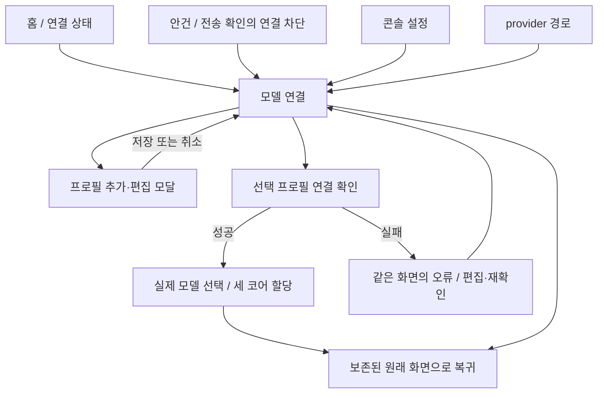
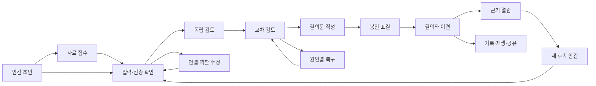

# 전체 UI 화면·상태 계약

이 문서는 모든 제품 화면의 정보 위계, 상태별 표현, 주 행동과 다음 화면을 소유한다. 공통 기하와 실행 중 상호작용은 [UI/UX](UI_UX.md), 색·서체·컴포넌트는 [디자인 시스템](DESIGN_SYSTEM.md), 실제 실행과 권한은 [아키텍처](ARCHITECTURE.md)·[보안](SECURITY.md)·[운영](OPERATIONS.md)이 소유한다.

[전체 화면 검토본](visuals/console/index.html)은 이 계약의 시각·조작 참조다. 화면 밖의 화면·상태 선택기는 디자인 검토 도구이며 제품 메뉴가 아니다. 검토용 합성 fixture는 디자인 산출물에만 존재하고 실행 앱의 기록·재생·공유 기능으로 제공하지 않는다. 제품 재생은 저장된 공개 이벤트만 사용하며 `REPLAY` 출처를 표시한다.

## 1. 화면 목록과 상태의 권위

[화면·상태 목록](visuals/console/design-contract.json)은 필수 route, variant, 창 종류, 검토 여정과 공통 오버레이의 기계 판독 계약이다. 화면 ID는 디자인 참조의 식별자이며 제품에 노출하는 기술 용어가 아니다. `default`는 해당 화면의 대표 상태를 뜻한다. 데이터 값만 다른 사례는 같은 화면의 상태 변형으로 표현한다.

각 route는 `index.html?screen=<id>&variant=<id>`로 직접 연다. 검토 도구가 현재 route·variant를 표시한다. `capture=1`은 앱 바깥 검토 도구만 숨기며 제품의 상태·초점·동작 설정을 바꾸지 않는다. 알 수 없는 경로는 오류 없는 입력 대기로 돌아가고 검토 도구가 잘못된 선택을 알린다.

| 화면군 | 시각 참조 | 소유하는 작업 |
|---|---|---|
| 사령실 시작 화면 | 네이티브 데스크톱 시작 화면 | 실제 시스템 상태, 진행 중 심의, 최근 기록과 새 심의 진입 |
| 명령 콘솔 | [입력](visuals/console/index.html?screen=input), [독립](visuals/console/index.html?screen=independent), [교차](visuals/console/index.html?screen=review), [작성](visuals/console/index.html?screen=proposal), [봉인](visuals/console/index.html?screen=sealed), [결의](visuals/console/index.html?screen=verdict) | 초안과 심의 단계·최종 판정 |
| 자료 접수 | [intake](visuals/console/index.html?screen=intake) | 원문·전달본·포함 범위·제외 사유 |
| 입력·전송 확인 | [confirmation](visuals/console/index.html?screen=confirmation) | 실제로 고정할 입력과 제공자별 전송 |
| 의견·근거 | [evidence](visuals/console/index.html?screen=evidence) | 제안·표·이견·인용 위치·수집본 |
| 중단·복구 | [paused](visuals/console/index.html?screen=paused&variant=auth), [interrupted](visuals/console/index.html?screen=interrupted), [cancelling](visuals/console/index.html?screen=cancelling), [cancelled](visuals/console/index.html?screen=cancelled), [failed](visuals/console/index.html?screen=failed), [save-error](visuals/console/index.html?screen=save-error) | 원인·보존 결과·허용된 복구 |
| 모델 연결 | [connections](visuals/console/index.html?screen=connections) | 프로필 목록·추가·편집, 연결 검증, 실제 모델 선택과 세 코어 할당 |
| 역할 | [roles](visuals/console/index.html?screen=roles) | 세 관점의 목적·기준·반증 조건 |
| 콘솔 설정 | [settings](visuals/console/index.html?screen=settings) | 표현·입력·음향·언어·예산 |
| 대화·기록 | [history](visuals/console/index.html?screen=history) | 실행 결과·분기·탐색·삭제 |
| 재생 | [replay](visuals/console/index.html?screen=replay), [import](visuals/console/index.html?screen=import) | 로컬 기록·외부 공유본 재생과 입력 검증 |
| 공유 | [share](visuals/console/index.html?screen=share) | 공개 범위·정제·실제 출력 미리보기 |
| 자료·보존 | [data](visuals/console/index.html?screen=data) | 권한 철회·삭제 영향·백업·복원 |
| 유지관리 | [maintenance](visuals/console/index.html?screen=maintenance) | 업데이트·복구·진단·라이선스 |
| 메뉴 막대 | [companion](visuals/console/index.html?screen=companion) | 같은 심의의 작은 상태 창과 콘솔 복귀 |

### 1.1 연결 설정 사이트맵과 사용자 흐름

모델 연결은 하나의 화면이다. 홈·헤더·입력 확인의 연결 상태와 콘솔 설정의 `모델 연결 관리`는 이 화면으로 직접 이동한다. `provider` 경로는 같은 화면으로 해석하며 별도 메뉴나 중간 페이지를 만들지 않는다. 설정은 표현·언어·음향·동작·읽기·예산·업데이트 설정을 소유하고 연결 편집을 중복 제공하지 않는다.

다음 여정은 [연결 시나리오](SCENARIOS.md#s07-지원되는-사용자-연결)와 [프로필 시나리오](SCENARIOS.md#s60-acp-프로필-생성편집선택)의 화면 매핑이다. 인증 권위는 보안 계약이 소유한다.

| 시작 조건 | 사용자 행동 | 화면 흐름과 보존 조건 |
|---|---|---|
| 프로필 없음 | 연결 차단 상태에서 추가 | 모델 연결 → 추가 모달 → 저장된 목록 → 연결 확인 → 모델·세 코어 할당 → 원래 안건 |
| 유효한 기존 프로필 | 프로필 선택·연결 확인 | 같은 화면에서 실제 확인 결과·모델을 표시하고 할당 후 복귀 |
| 인증 누락·만료 | 연결 확인 | 같은 화면의 단계별 오류에서 편집 모달·재확인으로 이어짐. 저장 성공을 연결 성공으로 표시하지 않음 |
| 경로 또는 revision 변경 | 저장·늦은 검증 응답 수신 | 새 revision은 기존 연결·모델 할당 검증을 무효화. 충돌은 입력을 보존하며 오래된 응답은 준비 상태를 복원하지 않음 |
| 진행 중 심의 있음 | 연결 편집 | 실행에 고정된 프로필 revision·모델·역할을 유지하고 새 설정은 후속 실행에 적용 |
| 초안·자료·읽기 위치 있음 | 연결 또는 설정 열기·복귀 | 원래 화면·질문·자료 선택·선택 실행·스크롤 위치 보존. 자동 제출·추론 호출 없음 |

복귀 대상은 진입 시 고정한다. 설정에서 연결로 이동하면 먼저 설정으로 돌아가며 설정의 복귀는 원래 안건으로 이어진다. 직접 진입해 복귀 대상이 없으면 홈으로 돌아간다.

## 2. 세 가지 공통 화면 형상

### 2.1 콘솔 무대

입력·심의·결의 화면은 전체 크기의 CoreTopology와 대형 단계 표제를 사용한다. 원점·경로·앵커는 상태와 무관하게 동일하다. 상단에는 공통 헤더와 안건, 하단에는 단계에 맞는 결의·행동 띠를 둔다. 표결 전에는 진행 단계만, 공개 후에는 세 표와 결과를 표시한다.

코어 이름과 상태는 실루엣 안의 안정된 영역에 둔다. 긴 의견·오류·설명은 도형 밖의 읽기 행으로 이동한다. 상태 변형마다 새 코어 그림이나 헤더를 만들지 않는다.

### 2.2 작업·읽기 화면

명령 콘솔의 자료·연결·역할·기록·설정 화면은 같은 공통 헤더·안건·상태 띠 안에서 문서형 작업 영역을 사용한다. 상단의 큰 압축 영문 제목, 한국어 작업명, 번호가 있는 각진 구획과 같은 축약 코어가 MAGI의 정체성을 유지한다. 앱 시작 화면은 별도의 네이티브 홈 형상이며 콘솔의 안건 띠와 하단 상태 띠를 반복하지 않는다.

본문은 주 작업 영역과 보조 맥락 영역으로 구성한다. 주 영역은 목록·편집·미리보기 중 해당 작업에 필요한 내용을 소유한다. 보조 영역은 세 코어·영향 대상·실행 중 고정 조건·복구 설명을 소유한다. 화면마다 장식용 숫자·도구 상태·임의 로그를 추가하지 않는다.

가용 폭에 따라 두 영역은 문서 순서대로 쌓인다. 메인 창 크기는 [데스크톱 크기 계약](UI_UX.md#21-기본-창)을 따르며 모바일 탐색 UI를 만들지 않는다. 긴 문서는 세로로 읽고, 중요 행동을 고정 패널 아래에 가두지 않는다.

### 2.3 메뉴 막대 표현

Companion은 별도 창 형상이다. 단일 짧은 표제, 축약 삼각 코어, 현재 안건, 결과 또는 원인, 복귀·취소·종료 행동 순서다. 메인 창의 브랜드·메뉴·안건 띠 전체를 축소해 넣지 않는다. 팝오버 크기·표시 대상·수명은 [메뉴 막대 계약](UI_UX.md#24-메뉴-막대와-상태-팝오버)이 소유한다.

## 3. 화면별 상세

### 3.0 사령실 시작 화면

네이티브 홈은 앱 진입점이다. 큰 제목과 실제 시스템 상태 뒤에 현재 또는 마지막 확인 심의를 담는 넓은 비대칭 명령 패널을 두고, 최근 기록은 별도 패널로 분리한다. 진행 심의의 세 코어는 같은 평면 삼각 기하를 축약해 표시한다. 주 행동은 새 심의 또는 실제 확인된 실행 열기이며 ACP 프로필과 역할 설정은 보조 행동이다. 실제 연결 상태와 로컬 저장 상태, 확인된 진행 중 심의, 저장소가 제공한 최근 실행 요약을 사용한다. 실행 요약은 안건·상태·기록 시각만 표시하며 저장소가 제공하지 않는 역할·투표·근거 수를 채워 넣지 않는다.

기록 조회의 로딩·사용 불가·오류·준비 완료는 서로 다른 상태다. 준비 완료와 실제 빈 결과에서만 `저장된 심의 기록이 없습니다`를 표시한다. 진행 중 심의가 최근 목록에도 존재할 때는 같은 실행을 중복 행으로 표시하지 않는다. 홈에서 실행을 열면 선택한 실행 ID를 보존해 기록 화면으로 이동한다.

### 3.1 입력과 심의

| 상태 | 첫 화면에서 읽는 내용 | 행동·전환 |
|---|---|---|
| 빈 질문 | 세 코어 대기, 질문 입력 안내 | 질문 입력에 초점. 빈 제출은 같은 필드 오류 |
| 자료 없는 질문 | 사용 자료 0개, 일반 지식 기반임을 표시 | 자료 추가 또는 자료 없이 입력 확인 |
| 자료 있는 초안 | 질문·선택 자료 수·세 관점 | 자료 접수, 역할, 입력 확인 |
| 후속 질문 | 부모 안건과 변경할 조건 | 부모는 읽기 전용, 새 입력 확인 |
| 진행 중 후속 초안 | 현재 실행 상태와 보존한 후속 문장 | 초안 유지. 자동 제출하지 않음 |
| 입력 준비 | 자료 확인·고정 입력 준비, 실제 준비 항목 | 자료 상태 보기, 취소 |
| 독립 검토 | 코어별 대기·진행·검증된 의견 준비 | 공개된 의견 보기, 취소 |
| 교차 검토 | 검토 중인 쟁점·출처·관점 차이 | 쟁점 상세, 취소 |
| 결의문 작성 | 후보 문안, 세 의견과 대응, 미검증 여부 | 읽기. 별도의 사용자 재승인 단계 없음 |
| 봉인 표결 | 고정 제안, 제출/미제출 수 | 제안 전문, 취소. 색·DOM·낭독·소리로 표 방향을 공개하지 않음 |

진행 단계의 강제 이동은 검토 도구에서만 제공한다. 제품 버튼이 모델의 응답을 완료시키거나 다음 단계의 조건을 우회하지 않는다.

### 3.2 결의와 근거

결과는 [표결 계약](DELIBERATION.md#ballots)의 세 유효 표에서 계산한다. 만장일치·다수 지지·부결·미결은 서로 다른 표제와 문구를 사용한다. 찬성·반대·기권 수, 실제 제안 전문, 반대 또는 기권 이유를 함께 읽는다. 기술 실패에는 결과 배지를 붙이지 않는다.

근거 화면의 순서는 제안 → 표결 → 공통 근거 → 의견 차이 → 출처·가정 → 미해결 사항 → 후속 질문이다. 인용 선택은 해당 자료의 수집 시점과 정확한 위치를 보여준다. 현재 파일 변경은 새 입력의 후보이며 과거 표의 근거를 바꾸지 않는다.

| 근거 상태 | 표현 | 다음 행동 |
|---|---|---|
| 수집본 확인 가능 | 파일명·수집 시각·사용 범위·원문/전달본 | 위치 열기, 후속 질문 |
| 현재 원본 변경 | 과거 수집본과 현재 파일 상태를 분리 | 최신 자료로 새 심의 준비 |
| 현재 원본 없음·접근 철회 | 현재 접근 상태와 보존 수집본을 구분 | 남아 있는 수집본 읽기 또는 자료 재선택 |
| 보존 근거 삭제·읽기 실패 | 본문 없는 참조·잃은 근거 범위·감사 제한 | 기록만 읽기 또는 재선택한 자료로 새 심의 |
| 외부 근거 없음 | 질문·모델 일반 지식 또는 가정임을 표시 | 자료 보완, 새 심의 |

### 3.3 자료 접수

왼쪽 자료 목록의 선택과 원문·전달본 미리보기는 한 상태를 공유한다. 목록 행은 포함 여부, 형식, 크기, 변환 여부와 제외 이유를 가진다. 드롭·파일 선택·붙여넣기는 같은 접수 흐름으로 합쳐진다.

| 변형 | 내용 | 주 행동 |
|---|---|---|
| empty | 포함 자료 없음 | 파일/폴더 선택, 텍스트 붙여넣기 |
| scanning | 확인 중인 항목과 완료된 목록 | 완료 자료 읽기, 수집 취소 |
| default | 포함 목록·선택 수집본·실제 전달 범위 | 범위 조정, 자료 확정 |
| permission | 거절된 경로와 허용 범위 | 파일 재선택, 해당 항목 제외 |
| excluded | 비밀 후보·미지원·크기 초과·추출 실패·범위 밖 링크 | 사유별 범위 수정·재시도·제외 |
| changed | 원본 변경과 기존 수집본 식별 | 새 수집본 확인 또는 기존 기록 읽기 |
| paste | 붙여넣은 원문과 별도 자료 제목 | 내용 확인 후 접수 |

로컬 접근 허용은 자료를 읽는 범위만 정한다. 외부 전송은 다음 확인 화면에서 별도로 결정한다. 선택 해제나 접수 화면 이탈은 자동 전송을 만들지 않는다.

### 3.4 입력·전송 확인

상단은 정확한 질문, 중간은 자료·역할·제공자별 전송 표, 하단은 호출 예산과 주 행동이다. 공유되는 자료에는 질문·역할·선택한 이전 기록·교차 평가·서기 문안을 포함한다. 같은 모델을 여러 관점에 배정한 사실은 이곳에서도 확인한다.

ready에서는 `이 입력으로 심의 시작`을 제공한다. 연결 미확인·인증·필수 기능 불충족은 해당 연결로, 문맥 초과는 자료 범위로, 입력 변경·권한 철회는 재확인으로 이동한다. 원인을 해결하고 돌아왔을 때 수정한 초안을 보존하고 변경된 입력을 다시 보여준다.

실행 예산은 앱의 호출 한도와 제공자 사용량을 구분한다. 미확인 사용량을 0·무제한·무료로 표현하지 않는다. 유료 경로나 다른 모델로 자동 전환하는 행동을 제공하지 않는다.

### 3.5 모델 연결

프로필 목록·연결 검증·실제 모델 선택·세 코어 할당은 하나의 모델 연결 화면 안의 구획이다. 추가·편집은 목록의 버튼에서 모달을 직접 열며 다른 관리 화면을 거치지 않는다. 연결 설정에 별도의 질문 전송창이나 지속적인 자료 폴더 권한 폼을 넣지 않는다.  목록은 사용자 프로필·실행 경로·모델·마지막 확인·인증·허용 상태를 보여준다. 세 코어 할당은 기본 이름과 선택한 프로필·모델을 함께 보여준다.

연결 생성·편집은 목록 위에 native dialog 모달로 열린다. 이름, 어댑터와 필수 기존 CLI 인증 홈 경로를 받는다. 편집은 저장된 이름과 native CredentialHome.displayPath를 채우며 어댑터를 고정한다. 경로는 절대 경로나 `~/…`로 직접 입력하고 목록에도 native 표시 경로를 보여준다. renderer는 홈 축약을 계산하지 않는다. 기본·커스텀 모드, 찾아보기, 자동 경로, 로그인, API 키 입력은 제공하지 않는다. 경로 변경은 새 revision으로 저장하고 연결·인증·모델·코어 할당을 다시 검증한다. 진행 중 실행의 고정 revision은 바뀌지 않는다.

모달은 접근 가능한 제목·설명과 이름 필드 초기 초점을 제공한다. native dialog가 초점을 가두며 닫으면 호출 버튼으로 복귀한다. Escape·취소는 저장하지 않으며 변경된 입력은 버리기 확인을 거친다. 저장 중에는 재제출·닫기·버리기를 차단한다. 저장 실패와 revision 충돌은 필드를 유지한다. 성공은 저장 결과를 목록에 먼저 반영하고 닫는다. 프로필 설정 지원과 실제 실행 준비는 별도 상태로 표시한다. 실행은 정확한 프로필 ID·revision·어댑터·홈 바인딩의 host attestation과 기존 구독 인증·모델 확인을 요구한다.

모델 선택은 선택한 프로필에서 확인한 실제 모델 목록을 사용한다. 사용자는 모델을 명시적으로 선택해 저장하며 목록의 첫 항목이나 제공자 기본값을 자동으로 선택하지 않는다. 어댑터가 실행 모드를 제공하면 같은 목록에서 지원 모드를 선택해 함께 저장한다. 모드를 제공하지 않는 어댑터에는 모드 선택을 요구하거나 가상의 모드를 만들지 않는다. 모델·모드 저장은 연결 확인이나 심의 시작과 구별된 행동이며 저장 실패·충돌 시 입력을 보존한다.

MELCHIOR·1, BALTHASAR·2, CASPER·3은 각각 저장된 프로필·모델과 해당되는 실행 모드 조합을 선택한다. 세 코어에 같은 조합을 배정할 수 있지만 한 코어의 선택을 나머지 코어에 조용히 복제하지 않는다. 각 할당은 프로필 revision, 검증한 모델 목록의 스냅샷, 저장된 모델 선택 revision에 연결된다. 세 할당의 일치와 유효성이 모두 확인되어야 입력 확인 화면에서 심의 시작을 제공한다. 코어별 선택·저장·오류 상태를 보여주며 내부 식별자와 revision은 필요한 진단 상세에서만 표시한다.

앱을 다시 열면 저장된 프로필·모델·모드 선택과 코어 할당을 읽고 할당된 프로필의 현재 홈·구독 인증·실제 모델 목록을 자동으로 확인한다. 확인 중이거나 확인에 실패한 코어는 심의 시작을 차단하고 저장된 선택은 유지한다. 확인이 성공하고 저장된 바인딩의 카탈로그·전체 실행물 정체성이 현재 검증 결과와 일치하면 실행 준비를 복원한다. 카탈로그나 검증된 실행물 정체성이 바뀌어도 저장한 선택을 화면에서 유지하며 실행 권위가 오래되어 재선택이 필요함을 표시한다. 사용자는 새 카탈로그에 있는 정확한 모델·모드 조합을 명시적으로 다시 선택하여 예상 선택 revision을 검사하는 CAS로 저장하고 영향을 받은 코어 할당을 다시 확인한다. 앱 시작·카탈로그 갱신은 첫 모델·기본 모드·기존 조합을 자동으로 선택하거나 저장하지 않는다. 선택한 모델·모드가 목록에서 사라지면 다른 조합으로 대체하지 않는다. 새 실행은 현재 카탈로그와 전체 실행물에 일치하는 세 코어의 검증 근거를 모두 요구한다. 늦은 조회·저장·검증 응답은 요청 당시의 프로필·목록·선택 revision이 현재 선택과 일치할 때만 반영한다.

실행 수락 시 세 코어의 프로필·모델·모드와 검증한 바인딩을 실행 입력으로 고정한다. 이후 연결 편집·모델 목록 갱신·할당 변경은 진행 중 실행의 바인딩을 바꾸지 않으며 다음 실행에만 적용된다. 인증 복구도 고정된 모델 경로를 유지하고, 다른 모델이나 프로필을 사용하려면 새 입력 확인과 새 실행을 만든다.

| 상태 | 주 행동 |
|---|---|
| 연결 없음 | 연결 추가. 초안·자료·역할·기록 사용은 유지 |
| 검증 중 | 수행 단계 확인, 중단 |
| 연결 준비됨 | 코어 할당, 안건으로 복귀 |
| 인증 필요 | 기존 CLI 인증 홈 확인·수정 후 연결 다시 확인 |
| 한도 초과 | 알려진 회복 시각 또는 미확인 표시, 사용자 재확인 |
| 실행물 없음·변경 | 실행 파일 재선택·재검증 |
| 필수 기능 불충족 | 미충족 기능과 차단 이유, 다른 지원 연결 선택 |
| 정책·호환성 미확인 | 확인되지 않은 조건과 비활성 이유. 사용 가능으로 승격하지 않음 |

### 3.6 역할과 설정

역할 편집은 정확히 세 슬롯을 유지한다. 기본 프리셋은 MELCHIOR/Scientist, BALTHASAR/Mother, CASPER/Woman의 이름 대응을 보존하고, reasoning rules는 성별·모성·직업 고정관념에 기대지 않는다. 기본 프리셋은 선택할 수 있지만 원본은 읽기 전용이다. 사용자는 기본 프리셋을 복제해 이름·역할명·목적·중시 기준·반증 조건·출력 언어를 편집한다. 세 슬롯 사이의 이동은 편집 내용을 보존한다. 사용자 프리셋은 예상 revision을 확인하며 저장하고, 충돌 시 최신 버전을 다시 연다. 저장은 새 실행의 역할 스냅샷에 적용하며 진행 중 심의의 역할을 덮어쓰지 않는다. 잘못된 프리셋·중복 식별자·권한 확대 지시는 필드 또는 가져오기 오류로 표시한다.

설정은 표현·음향·동작·언어·읽기·실행 예산 구획으로 나누며 `모델 연결 관리`로 단일 연결 화면에 직접 진입한다. Command/Clear, 동작 줄이기, 무음과 글자 크기는 메인과 팝오버에 같은 설정을 적용한다. UI 언어와 답변 언어는 별도 필드다. 예산 변경은 허용 범위를 검증하고 새 실행에 적용한다.

편집 중 이탈에는 저장·버리기·계속 편집을 제공한다. 확인 창이 원문 비밀이나 전체 개인 경로를 반복 표시하지 않는다. 설정 왕복 뒤 원래 질문과 근거 선택·읽기 위치로 돌아간다.

### 3.7 중단·실패·복구

| 화면·원인 | 보여주는 것 | 허용 행동 |
|---|---|---|
| paused/auth | 만료된 연결과 보존된 단계 | 인증 복구 후 명시적 재개 |
| paused/quota | 해당 제공자·알려진 회복 시각 | 연결 재확인 후 재개 |
| paused/needs-input | 저장된 필수 정보와 영향·보존된 부모 검토 | 부모에 고정한 자식 초안 만들기·다시 열기, 새 입력 확인 후 같은 대화의 자식 심의 |
| paused/validation | 잘못된 구조·문맥·참조 조건 | 같은 입력의 허용된 교정 또는 새 심의 |
| interrupted·timeout | 마지막 확인 시점·외부 요청 상태 미확인 | 상태 조회·정리, 자동 재호출 없음 |
| cancelling | 취소 의도와 아직 확인되지 않은 요청 | 상태 확인·부분 기록 |
| cancelled | 취소 결과와 보존된 의견 | 기록, 새 안건. 최종 판정 없음 |
| failed | 실패한 단계·원인·보존 범위 | 진단·부분 기록·새 심의 |
| save-error | 저장되지 않은 입력과 차단된 새 실행 | 재시도·안전한 내보내기 |
| 손상된 저장소 | 읽을 수 없는 범위와 보존된 데이터 | 별도 저장소 복원·진단 |

추가 입력 요청은 저장된 정보 부족 항목을 표시한다. 사용자는 정확한 부모 실행·revision·입력 digest·generation에 고정한 자식 초안을 명시적으로 만들거나 저장된 초안을 다시 연다. 질문에 답변을 직접 반영하고 새 자료를 선택하며, 질문과 자료는 같은 초안 revision으로 저장한다. 부모 검토는 원래 기록에서 읽고 자식 입력이나 전송 권한으로 자동 공유하지 않는다. 같은 입력을 그대로 재호출하지 않는다. 변경된 입력의 의미와 부모 관계는 [심의 계약](DELIBERATION.md)의 권위를 따른다.

자식 초안은 질문·자료 변경을 저장한 뒤 새 전송 동의와 세 코어의 저장된 모델·모드·역할을 확인하여 시작한다. 자식 결과는 같은 대화에서 부모 검토와 구분하여 읽는다. 편집은 부모 기록을 바꾸지 않는다. 초안 삭제는 확인 창에서 대상을 표시하며 닫으면 입력을 보존한다. revision 충돌은 작성한 질문과 마지막 저장 선택을 유지하고 최신 초안을 다시 확인하게 한다. 자료 변경은 같은 revision의 전송 확인을 무효화한다.

등록 중 취소는 원래 자식 요청의 취소 의도를 보존하며, 실제 저장 응답과 실행 중단을 구분한다. 늦게 발급된 권한이나 응답으로 새 실행을 시작하지 않는다. 부모가 바뀌거나 삭제되면 해당 초안의 실행을 차단한다. 복원된 초안은 현재 실행 권위가 확인되기 전에는 실행하지 않는다. 자료 권한과 공개 범위는 [보안 계약](SECURITY.md)을 따른다.

취소와 완료의 경합은 실제 저장된 상태로 표시한다. 사용자가 취소를 눌렀다는 이유만으로 완료한 실행을 취소로 다시 쓰지 않는다. 취소 확인은 질문·실행에 고정하며 다른 실행이 시작돼도 대상을 바꾸지 않는다.

### 3.8 대화와 기록

기록은 검색·상태 필터·대화/분기 목록과 선택 상세로 구성한다. 행은 저장된 제목·원래 시각·실행 상태·부모 관계를 표시한다. 진행·완료·취소·실패를 같은 성공 배지로 묶지 않는다. 상세 저장 자료를 읽을 수 없을 때는 요약만 보여 주고 근거·표·재생·분기 내용을 합성하지 않는다. 로딩·사용 불가·오류 상태는 빈 기록과 구별한다.

기록 없음은 새 안건과 연결 설정으로 이동하고, 검색 결과 없음은 조건 초기화, 읽기 실패는 다시 읽기와 진단을 제공한다. 선택한 기록에서 근거·재생·공유·후속 질문·같은 입력의 새 심의·삭제로 이어진다. 삭제된 선택은 비어 있는 성공 화면 대신 사유와 목록 복귀를 표시한다.

### 3.9 재생과 외부 입력

재생 화면은 출처 표식·원래 시각·단계 표시와 재생/정지·속도·단계 이동을 가진다. 단계 이동으로 과거 의견을 볼 때 최종 결과의 색이 이전 봉인 장면에 남지 않는다.

- 로컬 기록: REPLAY와 원래 실행 시각.
- 외부 공유본: EXTERNAL REPLAY와 실행 진위 미확인.
- 재생 완료: 마지막 공개 상태를 유지하고 처음·기록으로 이동.

외부 가져오기는 파일 선택·형식 확인·오류 사유·검증된 재생 진입 순서다. 잘못된 버전·초과 크기·참조 오류를 실제 기록으로 일부 병합하지 않는다. 재생·가져오기는 모델 호출·원본 경로 접근·동의를 생성하지 않는다.

### 3.10 공유·내보내기

왼쪽은 공개 범위와 정제 선택, 오른쪽은 실제 파생 결과 미리보기다. 포함되는 제목·제안·표·반대 의견과 제거되는 개인 경로·민감 문자열을 함께 확인한다. 정제된 문안은 원래 표를 옮긴 것이며 재표결 결과로 표시하지 않는다.

결의 문서·정적 이미지·공개 재생·원문 포함 묶음의 범위를 구분한다. 원문 포함 묶음은 공개 공유와 다른 선택이며 포함 자료를 다시 확인한다. 저장 중에는 해당 작업을 표시하고 완료는 대상 이름·형식과 결과 확인 행동을 제공한다. 실패는 입력·미리보기를 유지하고 재시도·저장 위치 변경을 제공한다. 덮어쓰기는 정확한 대상 하나를 확인한다.

### 3.11 권한·보존·백업

자료 접근 권한과 외부 전송 동의는 별도 목록·철회 행동을 가진다. 철회가 이미 보낸 자료를 회수하거나 수집본을 삭제했다는 표현을 만들지 않는다.

삭제 확인은 대상 종류, 영향 기록 수, 남는 기록과 잃는 근거를 표시한다. 실행 중 대상의 삭제는 실행 정리와 삭제 순서를 설명한다. 근거만 삭제와 대화·기록 삭제를 혼용하지 않는다.

백업은 포함 범위·원문 포함 여부·비밀 제외·대상 위치를 확인한다. 복원은 형식·무결성·호환성을 검증한 새 저장소로 전환한다. 실패하면 기존 저장소를 유지하고 원인과 재선택을 제공한다. 로그인·권한 동의·진행 중 요청을 자동으로 복원하지 않는다.

### 3.12 업데이트·진단·앱 정보

업데이트는 현재 버전·확인 상태·검증된 배포 정보·설치 가능 여부를 표시한다. 활성 심의가 있으면 설치가 대기하는 이유와 계속 사용·실행 정리 후 설치를 제공한다. 서명·호환성·마이그레이션 실패는 기존 기록을 보존하고 검증된 복구 경로로 이어진다.

`migration-error`는 기존 저장소를 보존한 채 새 심의를 차단하고, 검증된 백업을 별도 저장소에 복원하는 행동과 진단을 제공한다. 서명 실패의 배포 정보 재조회와 데이터 복원을 같은 행동으로 취급하지 않는다.

진단은 포함하는 앱·환경·오류 정보와 제외한 원문·질문·응답·비밀을 미리 보여준다. 전송·내보내기는 명시적인 사용자 행동이다. 앱 정보는 단일 콘솔 이름, 버전, 코드 라이선스와 외부 자산 출처를 제공한다.

### 3.13 메뉴 막대의 상태

| 상태 | 팝오버의 우선 정보·행동 |
|---|---|
| 대기 | 세 코어 대기, 새 안건으로 콘솔 열기 |
| 진행·여러 심의 | 현재 안건·단계·다른 진행 건수, 같은 안건 열기 |
| 봉인 | 제출 수만 표시, 제안 읽기·취소 |
| 결과 네 종류 | 정확한 표 조합·제안·이견 또는 기권 이유 |
| 중단 | 실제 이유·마지막 단계, 복구 콘솔 열기 |
| 상태 단절 | 마지막 확인 시각과 미확인 표시, 조회 |
| 과거 기록 | 기록 표식·원래 시각, 해당 기록 열기 |
| 대상 삭제 | 접근 불가 이유, 취소 비활성, 기록 목록 |
| 디스플레이 제한 | 실행 보존, 표시 가능한 화면으로 복귀 안내 |

작은 화면에서도 반대·기권·미확인 정보를 접힌 내부에만 숨기지 않는다. 바깥 클릭·Escape는 팝오버를 닫으며 심의를 취소하지 않는다. 명시적 앱 종료와 심의 취소는 서로 다른 확인 절차다.

Companion은 440×560 논리 픽셀 안에서 세 코어 이름·단계·상태와 모든 행동 이름을 읽을 수 있어야 한다. 글자 확대에서 축약 삼각 코어를 읽기 행으로 전환하고, 내용 영역만 내부 스크롤한다. 확대·긴 한국어 문구가 코어 이름·상태·키보드 초점을 자르거나 팝오버 창 밖으로 밀어내지 않는다.

## 4. 공통 오버레이와 네이티브 경계

| 표면 | 내용 | 초점과 결과 |
|---|---|---|
| 코어·쟁점·원문 상세 | 선택한 관점·공개 근거·수집 위치 | 닫으면 호출한 코어·인용으로 복귀 |
| 명령 검색 | 명령/안건 검색·일치 없음·키보드 선택 | 선택한 문맥으로 이동, Escape로 복귀 |
| 취소·종료 확인 | 대상 안건·영향·남는 기록 | 안전한 행동을 먼저 제공. 명시 확인 후 상태 전환 |
| 편집 버리기 | 저장되지 않은 필드의 영향 | 저장·버리기·계속 편집 |
| 삭제·철회·덮어쓰기 | 대상과 결과의 범위 | 해당 대상에만 적용, 확인 취소는 변경 없음 |
| 완료·저장 알림 | 실제 처리 결과 한 번 | 입력 초점을 빼앗지 않음. 상세 오류는 본문에도 남음 |

파일·폴더 선택과 저장 위치, 필요한 OS Keychain 접근은 macOS가 소유하는 시스템 표면이다. 기존 CLI 구독 정보는 사용자가 지정한 인증 홈에서 읽으며 앱 안에 공식 로그인 창을 제공하지 않는다. 앱은 시스템 표면의 진입 이유와 돌아온 뒤의 성공·취소·거절·실패 화면을 소유한다. 디자인 검토본은 이 복귀 결과를 합성 상태로 표현하며 시스템 권한 창을 구현했다고 주장하지 않는다.

## 5. 전환과 상태 보존

복구에서 원래 단계로 돌아가는 화살표는 고정 입력과 실제 요청 상태가 재개 조건을 만족할 때만 성립한다. 자료·모델·질문 변경은 새 안건으로 분리한다.

| 소유 상태 | 화면 왕복에서 유지하는 것 | 초기화 조건 |
|---|---|---|
| 안건 초안 | 질문·자료 선택·역할 편집 | 새 안건 또는 명시적 버리기 |
| 고정 실행 | 입력·제안·표·부모 관계 | 화면 탐색으로 초기화하지 않음 |
| 읽기 문맥 | 선택 코어·근거·기록·스크롤 | 새 대상을 명시 선택 |
| 전역 표현 | 음향·동작·테마·글자·밀도 | 설정 변경 |
| 비밀 입력 | 편집 창 안의 임시 값 | 제출·닫기·연결 경로 전환 |
| 팝오버 대상 | 열린 시점에 선택한 실행 | 재열기 또는 명시 선택 |
| 확인 대상 | 확인을 연 안건·파일·권한 | 대상 변경 시 미제출 확인 폐기 |

## 6. 구현 인계와 설계 판정

구현자는 화면별로 새 레이아웃을 해석해 만들지 않는다. [검토본](visuals/console/index.html)의 공통 셸·컴포넌트·토큰을 기준으로 화면을 옮기고, 실제 화면은 Coordinator의 명령·snapshot·이벤트에 연결한다. 검토용 합성 fixture를 실행 앱으로 복사하지 않는다. DOM 전체를 이미지로 대체하거나 화면별 중복 상태를 만들지 않는다.

설계 판정은 다음을 모두 확인한다.

1. 기계 판독 목록의 모든 화면과 상태를 직접 열 수 있다.
2. 명시한 여정과 버튼의 목적지가 존재하고, 막힌 행동은 이유와 해결 경로를 제공한다.
3. 같은 창 크기에서 공통 헤더·안건·코어 기하가 상태 때문에 달라지지 않는다.
4. 데스크톱 최소 창·권장 창·200% 글자와 팝오버에서 가로 넘침·가림 없이 읽고 조작한다.
5. 봉인·기권·실패·미확인·재생 출처가 시각과 접근성 표현에서 구분된다.
6. 초안·읽기 위치·표결 대상·취소 대상이 탐색이나 늦은 결과 때문에 바뀌지 않는다.
7. 독립 검토가 모든 화면군과 핵심 실패·복구 흐름을 확인한다.

설계 검토 결과는 작업 증거로 남긴다. 실제 Tauri 창·메뉴 막대·Keychain·VoiceOver·IME·제공자 적합성은 [제품 수용 시나리오](SCENARIOS.md)에 따라 구현 후 검증한다. 설계 참조의 완료를 실행 제품의 완료로 바꾸어 보고하지 않는다.

`node scripts/check-ui-design.mjs`는 필수 화면·변형, renderer와 탐색 목적지의 연결을 검사한다. `node scripts/check-docs.mjs`는 문서·참조의 구조를 검사한다. 두 검사 모두 실제 화면의 시각 판정이나 네이티브 동작을 대체하지 않는다.
